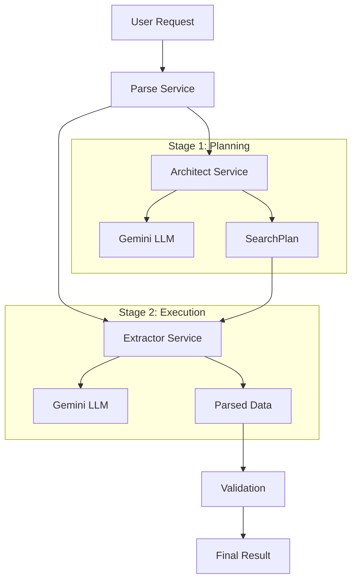

# Parserator Architecture: The Architect-Extractor Pattern

## Overview

Parserator implements a revolutionary two-stage LLM architecture that dramatically reduces token costs while improving parsing accuracy. This document details the technical architecture, design decisions, and implementation patterns.

## Core Problem

Traditional single-LLM parsing approaches suffer from:
- **High token costs**: Complex reasoning on large datasets
- **Inconsistent accuracy**: Single-pass processing prone to errors
- **Poor scalability**: Token costs scale linearly with input size
- **Limited adaptability**: Rigid schemas can't handle data variations

## Solution: Two-Stage Architecture

### Stage 1: The Architect
**Purpose**: Create a detailed parsing plan  
**Input**: Output schema + small data sample (~1000 chars)  
**Output**: Structured SearchPlan with extraction instructions  
**Token Efficiency**: Minimal data = minimal cost for complex reasoning  

### Stage 2: The Extractor  
**Purpose**: Execute the parsing plan  
**Input**: Full input data + SearchPlan from Architect  
**Output**: Final structured JSON data  
**Token Efficiency**: Direct execution with minimal reasoning overhead  

## Detailed Architecture



## Core Components

### 1. SearchPlan Interface

The bridge between Architect and Extractor:

```typescript
interface ISearchStep {
  targetKey: string;           // Output field name
  description: string;         // What this data represents
  searchInstruction: string;   // How to find it
  validationType: ValidationTypeEnum;
  isRequired: boolean;
  examples?: string[];
  pattern?: string;
  defaultValue?: any;
}

interface ISearchPlan {
  steps: ISearchStep[];
  totalSteps: number;
  estimatedComplexity: 'low' | 'medium' | 'high';
  architectConfidence: number;
  estimatedExtractorTokens: number;
  extractorInstructions?: string;
  metadata: {
    createdAt: string;
    architectVersion: string;
    sampleLength: number;
    userInstructions?: string;
  };
}
```

### 2. Service Architecture

#### GeminiService
- **Responsibility**: LLM API integration with Gemini 1.5 Flash
- **Features**: 
  - Retry logic with exponential backoff
  - Token usage tracking
  - Error handling and categorization
  - Response validation
  - Connection health monitoring

```typescript
class GeminiService {
  async callGemini(prompt: string, options?: ILLMOptions): Promise<ILLMResponse>
  async testConnection(): Promise<boolean>
  // Error handling, retries, token tracking
}
```

#### ArchitectService
- **Responsibility**: Generate SearchPlans from schemas + samples
- **Process**:
  1. Validate inputs (schema + data sample)
  2. Create optimized sample (max 1000 chars)
  3. Build architect prompt with schema context
  4. Call Gemini with planning-focused instructions
  5. Parse and validate generated SearchPlan
  6. Return structured result with confidence scoring

```typescript
class ArchitectService {
  async generateSearchPlan(
    outputSchema: Record<string, any>,
    dataSample: string,
    userInstructions?: string
  ): Promise<IArchitectResult>
}
```

#### ExtractorService
- **Responsibility**: Execute SearchPlans on full data
- **Process**:
  1. Validate SearchPlan and input data
  2. Build extractor prompt with plan instructions
  3. Call Gemini with execution-focused instructions
  4. Parse and validate extracted data
  5. Calculate field-level confidence scores
  6. Return structured result with metadata

```typescript
class ExtractorService {
  async executeSearchPlan(
    inputData: string,
    searchPlan: ISearchPlan
  ): Promise<IExtractorResult>
}
```

#### ParseService
- **Responsibility**: Orchestrate the two-stage workflow
- **Process**:
  1. Validate parse request
  2. Create optimized sample for Architect
  3. Execute Architect stage
  4. Execute Extractor stage
  5. Combine results and calculate metrics
  6. Apply fallback strategies if needed
  7. Return comprehensive parse result

```typescript
class ParseService {
  async parse(request: IParseRequest): Promise<IParseResult>
}
```

## Token Optimization Strategies

### 1. Sample Size Optimization
```typescript
private createOptimizedSample(inputData: string): string {
  if (inputData.length <= this.config.architectSampleSize) {
    return inputData;
  }
  
  // Break at natural boundaries (sentences, lines, etc.)
  const sample = inputData.substring(0, this.config.architectSampleSize);
  const breakPoints = [
    sample.lastIndexOf('.'),
    sample.lastIndexOf('\n'),
    sample.lastIndexOf(','),
    sample.lastIndexOf(' ')
  ].filter(pos => pos > 0);
  
  const bestBreakPoint = Math.max(...breakPoints);
  return bestBreakPoint > this.config.architectSampleSize * 0.7 
    ? sample.substring(0, bestBreakPoint + 1)
    : sample;
}
```

### 2. Prompt Engineering

**Architect Prompt Strategy:**
- Focus on analysis and planning
- Provide schema context and data patterns
- Request structured JSON output
- Emphasize instruction clarity for Extractor

**Extractor Prompt Strategy:**
- Focus on execution, not reasoning
- Provide direct, actionable instructions
- Minimize context and maximize efficiency
- Request structured JSON output only

### 3. Confidence-Based Processing

```typescript
private calculateOverallConfidence(
  fieldConfidence: Record<string, number>,
  searchPlan: ISearchPlan
): number {
  let weightedSum = 0;
  let totalWeight = 0;

  for (const step of searchPlan.steps) {
    const confidence = fieldConfidence[step.targetKey] || 0;
    const weight = step.isRequired ? 2.0 : 1.0; // Weight required fields more
    
    weightedSum += confidence * weight;
    totalWeight += weight;
  }

  return totalWeight > 0 ? weightedSum / totalWeight : 0.0;
}
```

## Error Handling Strategy

### 1. Service-Level Errors
```typescript
export class ArchitectError extends Error {
  constructor(
    message: string,
    public code: string,
    public details?: Record<string, unknown>
  ) {
    super(message);
    this.name = 'ArchitectError';
  }
}
```

### 2. Error Categories
- **Validation Errors**: Input validation failures
- **LLM Errors**: Gemini API issues (rate limits, timeouts, invalid responses)
- **Architect Errors**: SearchPlan generation failures
- **Extractor Errors**: Data extraction failures
- **System Errors**: Unexpected failures and infrastructure issues

### 3. Recovery Strategies
- **Exponential Backoff**: For transient LLM API errors
- **Fallback Plans**: Alternative extraction approaches for low confidence
- **Graceful Degradation**: Partial results when possible
- **Detailed Logging**: Comprehensive error context for debugging

## Performance Characteristics

### Latency Targets
- **Overall**: <3 seconds for 95% of requests
- **Architect Stage**: <1 second (small sample processing)
- **Extractor Stage**: <2 seconds (full data processing)

### Token Efficiency
- **Baseline**: Single-LLM approaches use 3000-5000 tokens
- **Parserator**: Typically uses 1000-1500 tokens (70% reduction)
- **Architect**: 200-500 tokens (planning on sample)
- **Extractor**: 800-1000 tokens (execution on full data)

### Scaling Patterns
```typescript
// Token usage scales with:
// - Output schema complexity (Architect)
// - Input data size (Extractor)
// - Required field count (both stages)

const estimateTokens = (inputSize: number, schemaFields: number) => {
  const architectTokens = 200 + (schemaFields * 20);
  const extractorTokens = 500 + Math.min(inputSize / 100, 1000);
  return architectTokens + extractorTokens;
};
```

## Security Considerations

### 1. Data Handling
- **No Persistence**: Input data is not stored
- **PII Detection**: Automatic masking of sensitive data (future)
- **Request Isolation**: Each request processed independently
- **Audit Logging**: Comprehensive request/response logging

### 2. API Security
- **Authentication**: API key validation
- **Rate Limiting**: Per-key request limits
- **Input Validation**: Comprehensive request validation
- **Error Sanitization**: No sensitive data in error responses

### 3. LLM Security
- **Prompt Injection Protection**: Input sanitization
- **Output Validation**: Structured response parsing
- **Content Filtering**: Gemini safety filters
- **Token Limits**: Maximum token usage per request

## Monitoring & Observability

### 1. Key Metrics
```typescript
interface IPerformanceMetrics {
  // Latency metrics
  architectLatencyP95: number;
  extractorLatencyP95: number;
  overallLatencyP95: number;
  
  // Accuracy metrics
  averageConfidence: number;
  lowConfidenceRate: number;
  
  // Cost metrics
  averageTokensPerRequest: number;
  tokenEfficiencyRatio: number;
  
  // Error metrics
  errorRateByStage: Record<string, number>;
  retrySuccessRate: number;
}
```

### 2. Health Checks
```typescript
async getHealthStatus(): Promise<{
  status: 'healthy' | 'degraded' | 'unhealthy';
  services: Record<string, boolean>;
  timestamp: string;
}> {
  const geminiHealthy = await this.geminiService.testConnection();
  return {
    status: geminiHealthy ? 'healthy' : 'unhealthy',
    services: {
      gemini: geminiHealthy,
      architect: true,
      extractor: true
    },
    timestamp: new Date().toISOString()
  };
}
```

### 3. Logging Standards
```typescript
// Structured logging with consistent format
this.logger.info('Parse operation started', {
  requestId,
  userId,
  inputLength: request.inputData.length,
  schemaFields: Object.keys(request.outputSchema).length,
  operation: 'parse'
});
```

## Future Optimizations

### 1. Caching Strategies
- **SearchPlan Caching**: Reuse plans for similar schemas
- **Pattern Recognition**: Learn from successful extractions
- **Response Caching**: Cache results for identical inputs

### 2. Model Optimization
- **Fine-tuning**: Custom models for specific domains
- **Model Selection**: Choose optimal model per complexity
- **Parallel Processing**: Concurrent Architect/Extractor calls

### 3. Advanced Features
- **Batch Processing**: Handle multiple inputs efficiently
- **Stream Processing**: Real-time data parsing
- **Confidence Tuning**: Adaptive confidence thresholds

---

This architecture provides the foundation for a production-ready, scalable, and cost-effective data parsing service that can handle the chaotic nature of real-world data while maintaining high accuracy and performance standards.